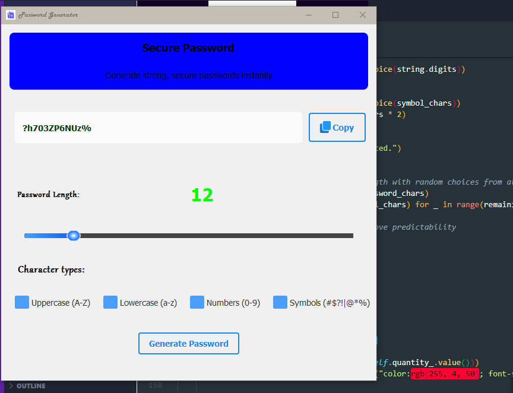

# Password Generator Application

A secure and customizable password generator tool built with Python.



## Features

- Generate strong, random passwords with customizable length
- Option to include/exclude special characters, numbers, and uppercase letters
- Copy to clipboard functionality
- Simple and intuitive user interface
- Configurable security parameters

## Installation
```bash
# 1. Clone the repository and enter directory
git clone https://github.com/abu-muhammedx7/pyqt5-password-generator.git && \
cd pyqt5-password-generator

# 2. Install dependencies (PyQt5)
pip install PyQt5

# 3. Run the application
python main.py
